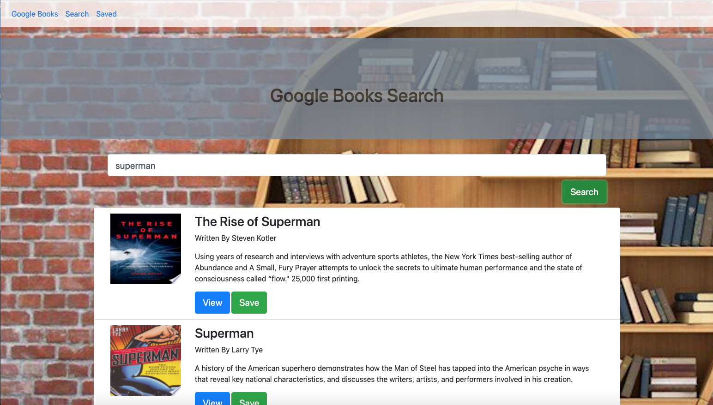

# Google Books Search #

This app was deployed at: https://reactbooksearch123.herokuapp.com/

This is a React-based Google Books Search app. The user can search for books via the Google Books API and render them here.
. or  "Delete" a book, removing it from the Mongo database.

The user has the option to "View" a book, bringing them to the book on Google Books, or "Save" a book, saving it to the Mongo 
database

